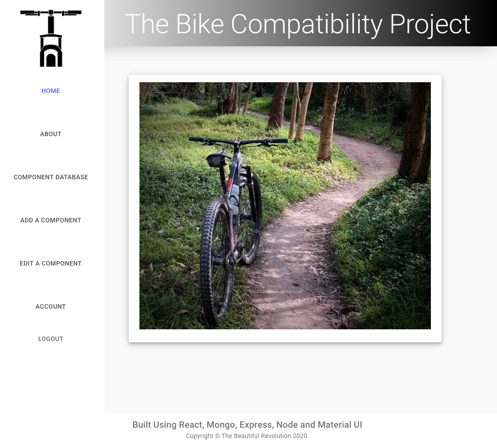
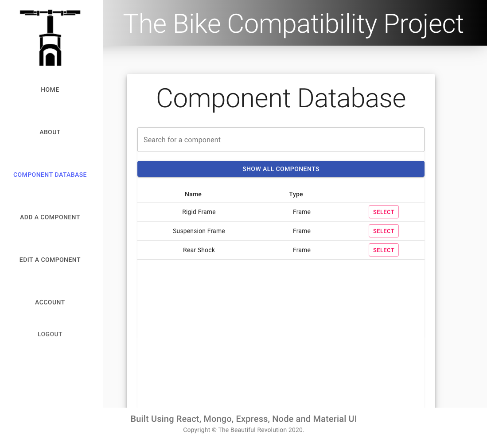
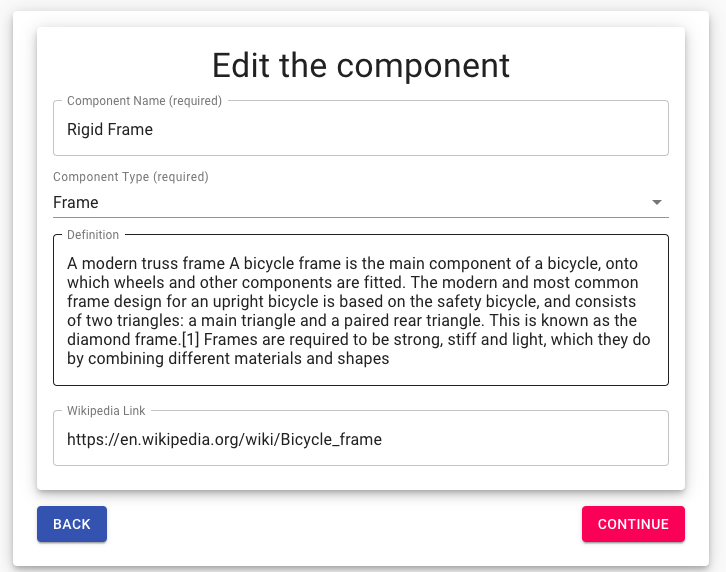

# The Bike Compatibility Project

<svg xmlns="http://www.w3.org/2000/svg" xmlns:xlink="http://www.w3.org/1999/xlink" width="96" height="20"><linearGradient id="b" x2="0" y2="100%"><stop offset="0" stop-color="#bbb" stop-opacity=".1"/><stop offset="1" stop-opacity=".1"/></linearGradient><clipPath id="a"><rect width="96" height="20" rx="3" fill="#fff"/></clipPath><g clip-path="url(#a)"><path fill="#555" d="M0 0h79v20H0z"/><path fill="#97ca00" d="M79 0h17v20H79z"/><path fill="url(#b)" d="M0 0h96v20H0z"/></g><g fill="#fff" text-anchor="middle" font-family="DejaVu Sans,Verdana,Geneva,sans-serif" font-size="110"> <text x="405" y="150" fill="#010101" fill-opacity=".3" transform="scale(.1)" textLength="690"></text><text x="405" y="140" transform="scale(.1)" textLength="690">Version</text><text x="865" y="150" fill="#010101" fill-opacity=".3" transform="scale(.1)" textLength="70"></text><text x="865" y="140" transform="scale(.1)" textLength="160">1.0</text></g> </svg>

## Description

A React-based application deployed using a Mongo, Express, Node and Material UI build.

This project is a proof of concept for an application dealing with the intricate compatibility relationships of bicycle components. The application hopes to make a user friendly database of information for bicycle industry. It shows which other components can come into contact with, and also which other components can influence any individual component. By having a quick at hand reference less issues can result from not considering all possible compatibility issues.

The application employs role based authentication that has a user and an admin level. Users are able to see the database but not edit or add components. An admin role can add and edit components.

## Table of Contents

- [Description](#description)
- [Screenshot](#screenshot)
- [Installation](#installation)
- [Usage](#usage)
- [Authors and Acknowledgment](#authors-and-acknowledgment)
- [License](#license)

## Screenshot

The Home Page:

The Component Database Page:

The "Add/Edit Component" Component:

## Installation

The application has been deployed on Heroku [here](https://floating-retreat-84078.herokuapp.com/)

## Usage

When the user loads the main page, they are given the ability to search the BoogleBooks database:

- Once a search is done a list of books is rendered from the search request, within this list the user is able to save books to a Mongo database.

- In the Saved Page the user is able to view all the saved books within the database, and delete at will.

## Authors and Acknowledgment

### Main Author

[DCRevResLabs](https://github.com/DCRevResLabs)

## License

© 2020 The Beautiful Revolution. All Rights Reserved.
